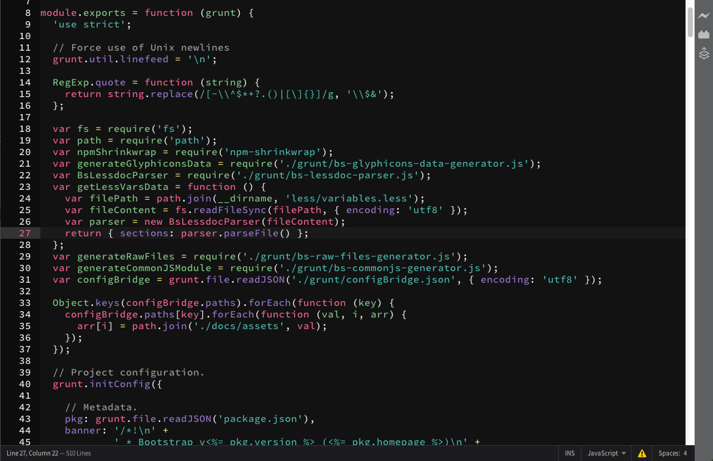
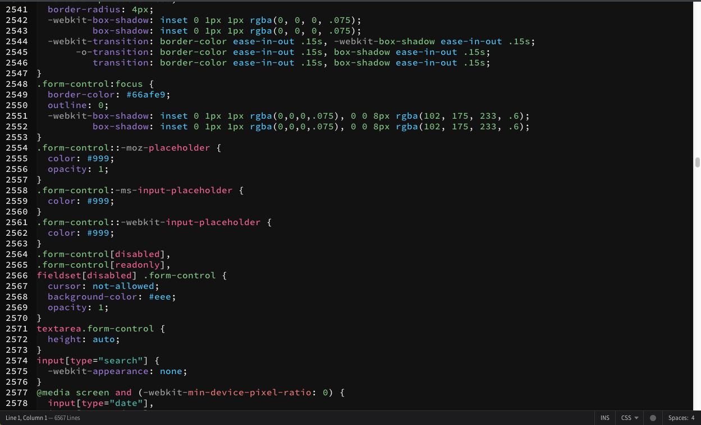
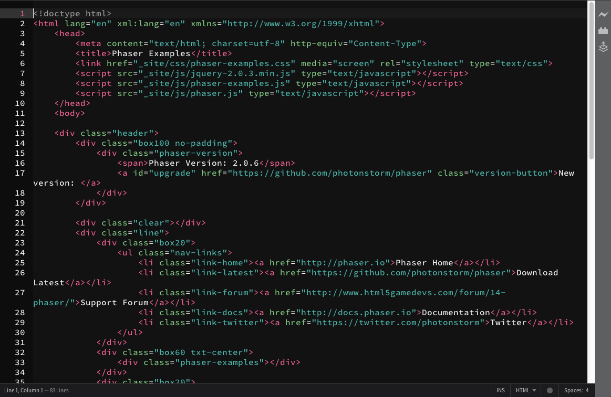

# Brackets Theme: material-300

This theme uses Google's Material Design color palette.
All but gray use the 300 value hence the name.

#Screenshots
### Javascript

### CSS

### HTML

Installation
---
This extension requires Brackets Release 1.0 or newer.

1. Download this theme
2. Open Brackets
3. Click on "Help" and select "Show Extensions Folder"
4. Open the folder "user"
5. Move the chill to "user"
6. In Brackets, open "Themes" and select chill

You can find the same theme for Atom [here](https://github.com/arturoalviar/material-300-brackets)
